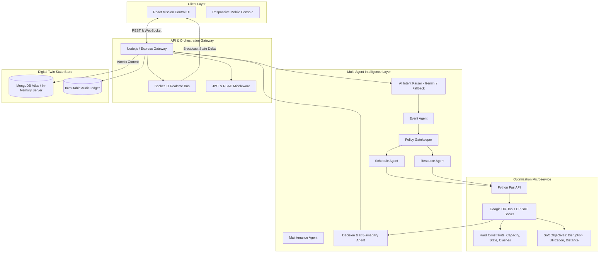

# CAMPUSSYNAPSE SYSTEM ARCHITECTURE

## 1. High-Level Architecture Diagram

## 2. Multi-Agent Delegation Model

Each agent acts as a specialized micro-service within the system:
1. **ScheduleAgent**: Detects overlapping intervals, evaluates timetable disruptions, and identifies available windows.
2. **ResourceAgent**: Validates certified seat capacity, filters operational hardware (laser projectors, line-array audio), and monitors live IoT telemetry.
3. **MaintenanceAgent**: Classifies natural language facility reports into categories (Equipment, Electrical, HVAC, Plumbing) and triggers immediate emergency lockouts on high-voltage or flood hazards.
4. **PolicyAgent**: Hard deterministic institutional validator (no over-booking, no maintenance overrides, mandatory admin authorization on high-capacity events).
5. **DecisionAgent**: Synthesizes multi-criteria scoring into human-readable transparency cards ("Why this decision?").
6. **NotificationAgent**: Formats in-app and dispatch payloads.

## 3. Constraint Programming (Google OR-Tools CP-SAT)

The optimizer solves the room allocation problem deterministically:
- **Decision Variables**: $x_{i,r} \in \{0, 1\}$, indicating whether event $i$ is assigned to room $r$.
- **Hard Constraints**:
  - $\sum_{r} x_{i,r} = 1$ (every event is assigned to at most one space).
  - $x_{i,r} \cdot \text{Attendees}_i \le \text{Capacity}_r$.
  - $\text{Status}_r \ne \text{MAINTENANCE} \land \text{Status}_r \ne \text{BLOCKED}$.
  - Overlap constraint: For any existing booking $b$ in room $r$ overlapping with $[t_{\text{start}}, t_{\text{end}}]$, either $x_{i,r} = 0$ or $b$ must be flagged for rescheduling.
- **Objective Function**:
  $$\max \sum_{r} x_{i,r} \left( w_{\text{feas}} \cdot S_{\text{feas}} + w_{\text{disrupt}} \cdot S_{\text{disrupt}} + w_{\text{util}} \cdot S_{\text{util}} + w_{\text{dist}} \cdot S_{\text{dist}} \right)$$
